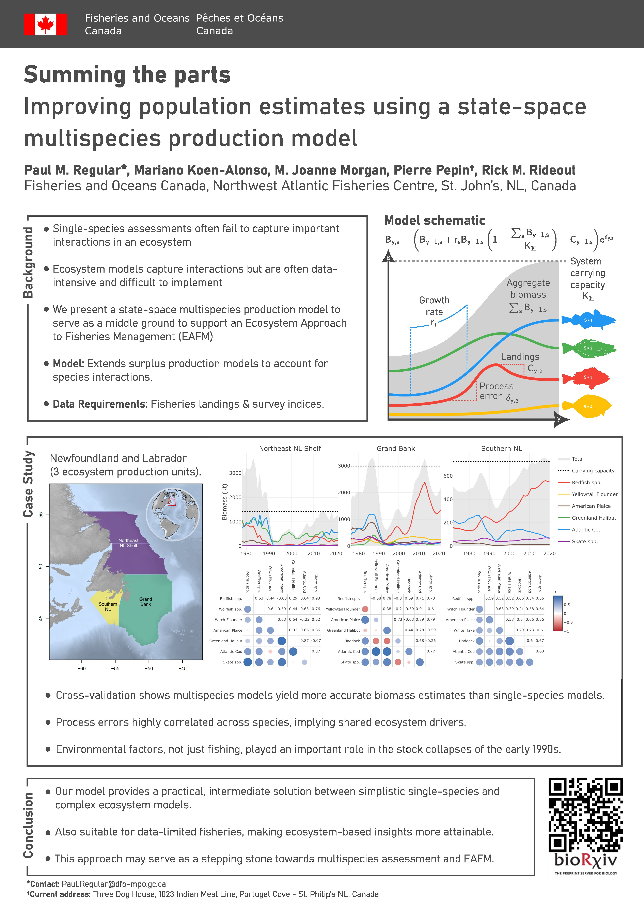

# `multispic`: A state-space multispecies production model

This research compendium outlines the methods behind a **state-space multi-species production model**
and its application to a case study. Core methods are wrapped into an R package called `multispic`, which
can be installed as follows:

```r
# install.packages("remotes")
remotes::install_github("PaulRegular/multispic")
```

## Repository layout

```
.
├─ R/                   # Package functions (roxygen2-documented)
├─ scr/                 # TMB C++ templates
├─ analysis/
│  ├─ NL_case_study/    # Scripts to reproduce the case study
│  ├─ paper/            # Paper text, figures, and tables
│  └─ poster/           # Visual summary of the case study
├─ data-raw/            # Scripts to build data objects (creates files in data/)
├─ data/                # Packaged datasets used by the package/analysis
├─ man/                 # Help files auto-generated by roxygen2
├─ DESCRIPTION          # Package metadata
├─ NAMESPACE            # Generated by roxygen2
└─ README.md
```


## Case study



For more details, see the full manuscript: https://doi.org/10.1101/2025.02.20.639295
